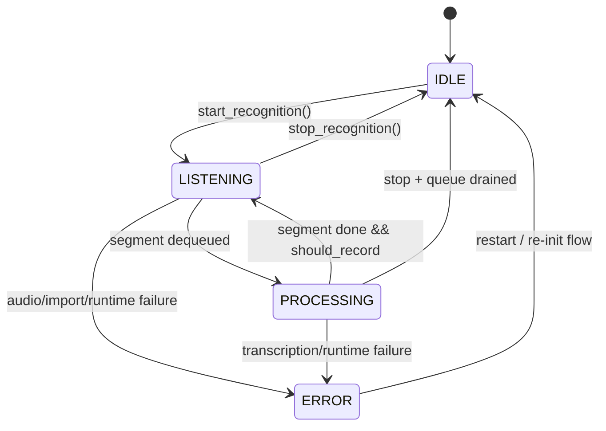

# Architecture: Current State

This document describes the current dictation pipeline and control/data flow from microphone capture to text injection.

## Pipeline Walkthrough

## 1) `_record_audio` (capture thread)

`SpeechRecognitionManager.start_recognition()` starts `_record_audio` on `audio_thread`.

What `_record_audio` does today:

- Opens PyAudio input stream (with reconnection logic).
- Reads chunks into `self.audio_buffer` under lock.
- Performs channel normalization/resampling to 16kHz when needed.
- Runs simple VAD/silence logic:
  - In `toggle` mode: on silence timeout, enqueues buffered segment via `_enqueue_audio_segment(...)` and clears buffer.
  - In `push_to_talk` mode: defers enqueue until key release / stop path.
- Emits audio-level callbacks for UI metering.

## 2) `_perform_recognition` (recognition thread)

`start_recognition()` also starts `_perform_recognition` on `recognition_thread`.

What `_perform_recognition` does today:

- Drains `_segment_queue` in a loop.
- For each segment:
  - sets state to `PROCESSING`,
  - calls `_process_audio_buffer(segment)`,
  - sets state back to `LISTENING` if still recording.
- Handles stop via queue sentinel (`None`) and queue-drain logic.

## 3) `_process_audio_buffer` (transcribe + parse)

For each immutable audio segment:

- Dispatches by engine:
  - `vosk` via recognizer `AcceptWaveform`/`FinalResult`,
  - `whisper` via `_transcribe_with_whisper`,
  - `whisper_cpp` via `_transcribe_with_whispercpp`.
- Runs command processor (if voice commands enabled):
  - returns `(processed_text, actions)`.
- Emits callbacks:
  - `text_callbacks(processed_text)` for dictation text,
  - `action_callbacks(action)` for commands.

## 4) `main.py` callback bridge to injection

`main.py` wires callbacks:

- `register_text_callback(text_callback_wrapper)`
- `register_action_callback(action_handler.handle_action)`
- `register_state_callback(on_state_change)`

`text_callback_wrapper` behavior:

- strip segment text,
- prepend a space between consecutive injected segments,
- call `text_system.inject_text(...)`,
- record last injected text for undo/delete behavior.

So today, **recognized text is injected immediately from callback path**.

## Callback/Data-Flow Diagram (Current)

```mermaid
flowchart LR
  Mic[Microphone] --> A[_record_audio\n(audio_thread)]
  A -->|silence / stop| Q[_segment_queue]
  Q --> R[_perform_recognition\n(recognition_thread)]
  R --> P[_process_audio_buffer]
  P -->|processed_text| TC[text_callbacks]
  P -->|actions| AC[action_callbacks]
  TC --> M[text_callback_wrapper in main.py]
  M --> TI[TextInjector.inject_text]
  AC --> AH[ActionHandler.handle_action]
  AH --> TI
```

## Threading Model

- **GTK main thread**
  - App lifecycle, tray UI, most UI interactions.
- **Audio capture thread**
  - `_record_audio`, microphone reads, VAD chunking.
- **Recognition thread**
  - `_perform_recognition`, queue-drain and per-segment transcription.

### Shared structures and synchronization

- `self.audio_buffer` protected by `self._buffer_lock` during mutation/copy.
- Model/recognizer access guarded via `self._model_lock` in critical sections.
- Segment handoff uses thread-safe `queue.Queue` (`self._segment_queue`).

## State Transitions (Current)

Recognition states are: `IDLE`, `LISTENING`, `PROCESSING`, `ERROR`.



## Notes on Current Behavior

- Stop path tries to avoid stop-sound transcription by discarding tail audio chunks before final enqueue.
- Immediate injection happens in text callback path, not in GTK event-loop-owned workflow.
- Push-to-talk behavior differs at VAD enqueue boundary (defers until release/stop).
