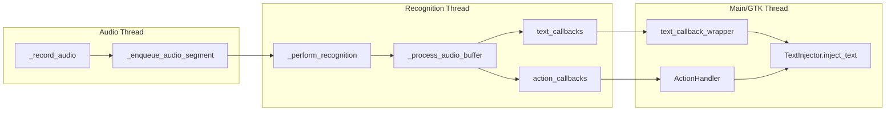
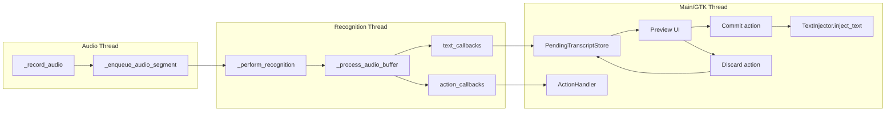

# Implementation Breakdown (MVP: Preview + Deferred Injection)

This plan breaks MVP delivery into ordered tasks with acceptance criteria and test strategy.

## Task 0 — Baseline mapping and feature flag

### Deliverables
- Add an explicit mode/flag for transcript behavior:
  - `immediate_injection` (current behavior)
  - `preview_deferred_injection` (MVP)
- Ensure startup wiring reads this mode from config/settings.

### Acceptance criteria
- Default mode preserves current production behavior.
- Preview mode can be enabled without breaking start/stop recognition.

### Test strategy
- Unit test config parsing + mode selection.
- Smoke test start/stop in both modes (mocked recognition + injector).

---

## Task 1 — Pending transcript store + events

### Deliverables
- Introduce a pending transcript accumulator component (thread-safe API).
- Replace direct callback->inject path in preview mode:
  - recognition callback appends to pending store,
  - emits update notifications for UI.

### Acceptance criteria
- In preview mode, dictated text is accumulated but not injected.
- Segment spacing behavior is deterministic and documented.
- Pending buffer can be cleared atomically.

### Test strategy
- Unit tests for append/merge/clear semantics.
- Concurrency tests for callback-thread append + UI-thread read.

---

## Task 2 — Preview UI surface and actions

### Deliverables
- Add minimal preview surface (tray dialog/popover/window) to show pending transcript.
- Add controls:
  - Commit (inject now)
  - Discard (clear pending)
  - Optional Copy (nice-to-have for MVP if trivial)

### Acceptance criteria
- User can inspect pending text before injection.
- Commit performs one injection transaction for full pending text.
- Discard leaves focused app unchanged.

### Test strategy
- UI logic tests around action handlers (can be presenter/controller-level).
- Integration-style test with mock injector validating commit/discard outcomes.

---

## Task 3 — Commit pipeline + state integration

### Deliverables
- Implement deferred commit path to `TextInjector.inject_text`.
- Define behavior on recognition state change:
  - e.g., on transition to `IDLE`, keep or clear pending text according to policy.
- Ensure command actions remain correct (or gated) in preview mode.

### Acceptance criteria
- Commit injects exactly pending transcript and then clears it.
- No accidental auto-injection on stop unless explicitly configured.
- Action callbacks do not corrupt pending text state.

### Test strategy
- Unit tests for state-transition policy.
- Integration tests for sequence:
  - start → dictate segments → stop → commit
  - start → dictate → discard
  - push-to-talk and toggle mode variants.

---

## Task 4 — Hardening, regressions, and docs

### Deliverables
- Validate legacy immediate mode remains intact.
- Add/refresh developer docs for data flow and mode behavior.
- Add telemetry/logging breadcrumbs for pending/commit/discard lifecycle.

### Acceptance criteria
- Existing command and injection behavior unchanged in immediate mode.
- Preview mode verified with both `whisper_cpp` and at least one alternate engine.
- Documentation updated and discoverable.

### Test strategy
- Regression suite across both modes.
- Manual matrix test on X11 + Wayland if available.
- Negative-path tests for injector failure on commit.

## Mermaid: Current Threading and Callback Flow

## Mermaid: Planned MVP Flow (Preview + Deferred Injection)

## End-to-End MVP Acceptance (Cross-task)

- Dictation in preview mode never injects automatically.
- Commit/discard are explicit and deterministic.
- Legacy immediate mode behavior remains unchanged.
- No thread-safety regressions under rapid start/stop and multi-segment dictation.
